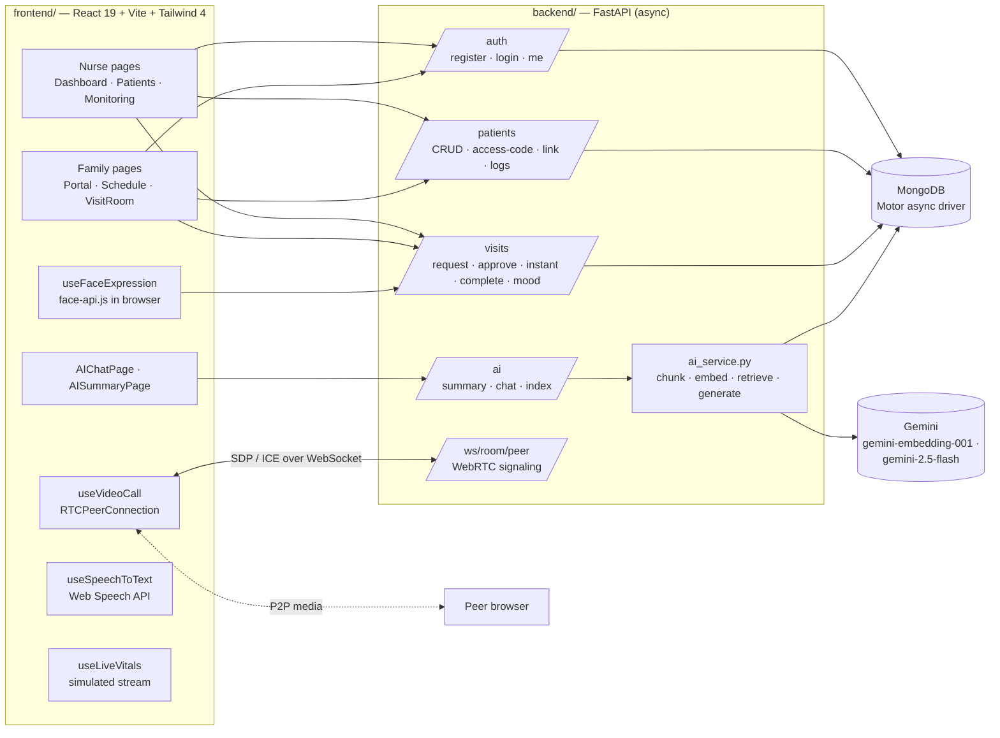

# VisiCare: ICU Virtual Visitation Platform

**Families can see, hear and understand a loved one in the ICU without being at the bedside.**

VisiCare connects ICU nurses and patients' families. Nurses register patients and share a 6-digit access code. Families link to the patient with that code, request visit slots and join **WebRTC video calls** once a nurse approves. Throughout, they get **live vitals**, mood tracking, and a **Gemini-powered RAG assistant** that explains the patient's records in plain language.

---

## Features

| For nurses | For families |
|---|---|
| Register and edit patients (bed, status, records) | Link to a patient with the 6-digit access code |
| Generate or rotate the family access code | Request scheduled or instant visits |
| Approve or complete visit requests | Join a peer-to-peer video visit (WebRTC) |
| Live monitoring dashboard: ECG wave, vitals, medicine timeline | View live vitals and the patient report |
| Monitoring logs and status updates | AI summary and AI chat about the patient's condition |
| | Mood check-in during calls (face-expression detection) and speech-to-text |

Also included: role-based auth (nurse or family) with JWT, an audit log, async messages, notifications, light and dark themes, connection-quality and session-timer indicators.

## Architecture



### AI assistant (RAG)

1. `POST /ai/index/{patient_id}` splits the patient's records and reports into chunks of about 500 characters, embeds them with `gemini-embedding-001`, and stores them as `PatientDocumentChunk` documents.
2. `POST /ai/chat/{patient_id}` embeds the question, retrieves the top-k chunks by cosine similarity, and answers with `gemini-2.5-flash` using the chat history.
3. `GET /ai/summary/{patient_id}` generates a family-friendly status summary.

### Data model (MongoDB collections)

`User` · `Patient` · `FamilyLink` · `Visit` · `MoodLog` · `AsyncMessage` · `AuditLog` · `PatientDocumentChunk`

## Getting started

### Backend

```bash
cd backend
python -m venv .venv && source .venv/bin/activate   # Python 3.11
pip install -r requirements.txt
# backend/.env
#   SECRET_KEY=...        MONGODB_URL=mongodb://localhost:27017
#   GEMINI_API_KEY=...
python seed_sample_data.py          # optional demo data
python run.py                       # http://localhost:8000  (docs at /docs)
```

### Frontend

```bash
cd frontend
npm install
npm run dev                         # http://localhost:5173
```

### Demo flow

1. **Nurse:** choose *Hospital Staff* and add a patient, for example John Doe in Bed 7.
2. Note the **6-digit access code** on the patient card.
3. **Family:** in a second tab, choose *Family Member* and enter the code to link.
4. Request a visit. Back in the nurse tab, click **Approve**.
5. Click **Join Call** in both tabs to start the WebRTC video visit.

## Project structure

```
ICU/
├── backend/app/
│   ├── main.py · config.py · database.py · models.py
│   ├── ai_service.py          # RAG over patient records
│   ├── auth/deps.py           # JWT dependencies
│   └── routes/                # auth, patients, visits, ai, signaling
├── frontend/src/
│   ├── pages/                 # nurse, family, AI, video pages
│   ├── hooks/                 # video call, vitals, face expression, STT
│   └── components/            # monitoring widgets, UI kit
├── frontend/public/models/    # face-api.js weights
└── docs/                      # architecture, features, schema, API, compliance, roadmap
```

The `docs/` folder holds the full product design, including a production AWS target architecture, the database schema, the API design, compliance notes (HIPAA/DPDP) and the roadmap.

## Tech stack

FastAPI · Motor (MongoDB) · python-jose · bcrypt · Google Gemini (`google-genai`) · React 19 · TypeScript · Vite · Tailwind CSS 4 · React Router 7 · WebRTC · face-api.js · Web Speech API
